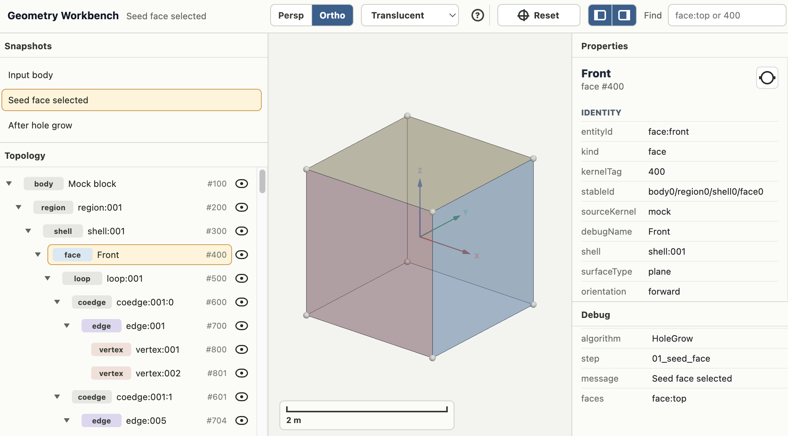

# Geometry Kernel Workbench

[](https://github.com/plxdhong/gks_view/actions/workflows/vscode-extension-ci.yml)


Geometry Kernel Workbench is an open-source VS Code workbench for inspecting
GKS geometry snapshots, topology trees, compare views, and adapter-driven
debugging flows.

Geometry Kernel Workbench 是一个面向 GKS 几何快照的开源 VS Code 工作台，
用于查看三维场景、遍历拓扑树、检查属性、对比快照，并调试几何内核适配器输出。

## Screenshot



Shown here: the seeded-face step with synchronized snapshots, topology
inspection, a read-only Three.js viewport, and per-entity property/debug
details.

## Highlights

- Open `.gkcase.json`, `.gkscene.json`, `.gkcompare.json`, and `.gkrun.json`
  artifacts in a dedicated VS Code workbench.
- Inspect topology hierarchies, entity properties, kernel tags, and debug
  metadata without leaving the viewer.
- Compare geometry snapshots and adapter outputs with side-by-side visual flows.
- Develop against a mock stdio JSON-RPC adapter before wiring a real kernel.
- Generate and validate sample GKS cases, including OCC/OpenCascade examples.

## Repository Layout

- `packages/gks-schema`: shared TypeScript types and JSON Schema documents.
- `packages/vscode-extension`: VS Code custom editor and Three.js webview.
- `packages/vscode-extension/src/mockAdapter`: stdio JSON-RPC mock adapter.
- `packages/native-common`: native common-library scaffold for future wrappers.
- `packages/occ-wrapper`: OCC/OpenCascade example wrapper that can emit GKS
  files.
- `examples/mock`: generated mock `.gkcase.json`, `.gkscene.json`, and
  `.gkcompare.json` fixtures.

## Quick Start

```sh
bun install
bun run generate:mocks
bun run validate:mocks
bun run build
bun run verify:adapter
```

For webview UI development:

```sh
bun run dev:webview
```

Then open the printed local URL in a browser.

Useful development URLs:

- `http://127.0.0.1:5173/` opens the HoleGrow timeline mock.
- `http://127.0.0.1:5173/?compare=1` opens the split compare mock.
- `http://127.0.0.1:5173/?case=occ/OCCBox.Case_001/index.gkcase.json` opens
  the generated OCC example after `bun run occ:example`.

Useful mock artifacts:

- `examples/mock/Cube.Case_001/index.gkcase.json`
- `examples/mock/CylinderHole.Case_001/index.gkcase.json`
- `examples/mock/HoleGrow.Case_001/index.gkcase.json`
- `examples/mock/SplitCompare.Case_001/split.gkcompare.json`

## Adapter Flow

The `Geometry: Attach Kernel Adapter` command starts the built-in mock adapter
over stdio and walks this minimal flow:

```txt
adapter.initialize -> adapter.getManifest -> model.open -> model.getScene
```

When an entity is selected, the webview requests `entity.getProperties` to
populate the side panel.

## OCC Example

If a matching prebuilt OCCT package is available, install it directly:

```sh
OCCT_BINARY_URL="https://github.com/.../download/.../occt-prebuilt.tar.gz" bun run occ:fetch-binary
```

Or install from a local archive already placed under
`third_party/occt/archives`:

```sh
bun run occ:fetch-binary third_party/occt/archives/occt-macos-arm64-modeling-only.zip
```

Then generate and validate the example:

```sh
bun run occ:example
```

To build OCCT from the official release archive instead:

```sh
bun run occ:fetch
bun run occ:build-release
bun run occ:example
```

By default the scripts use tag `V8_0_0`. Override it with `OCCT_TAG=...`. If
you already have OCC installed elsewhere, set `OpenCASCADE_DIR` or
`CMAKE_PREFIX_PATH` instead.

## Release Notes

GitHub Actions build the extension on pushes to `main` and on pull requests to
`main` or `release`.

The `release` branch is the packaging branch. Pull requests targeting
`release` must bump `packages/vscode-extension/package.json`'s `version` field
and add matching notes to `packages/vscode-extension/CHANGELOG.md`.

Local packaging uses:

```sh
bun run package:vscode
```

The generated VSIX is written under `build/vsix/`.

## Roadmap

- Add richer snapshot diff and compare workflows.
- Expand native-wrapper examples beyond the current OCC scaffold.
- Improve adapter tooling for real kernel integrations and automated debugging.
- Continue polishing the VS Code extension for public preview releases.

## License

MIT. See [LICENSE](LICENSE).
